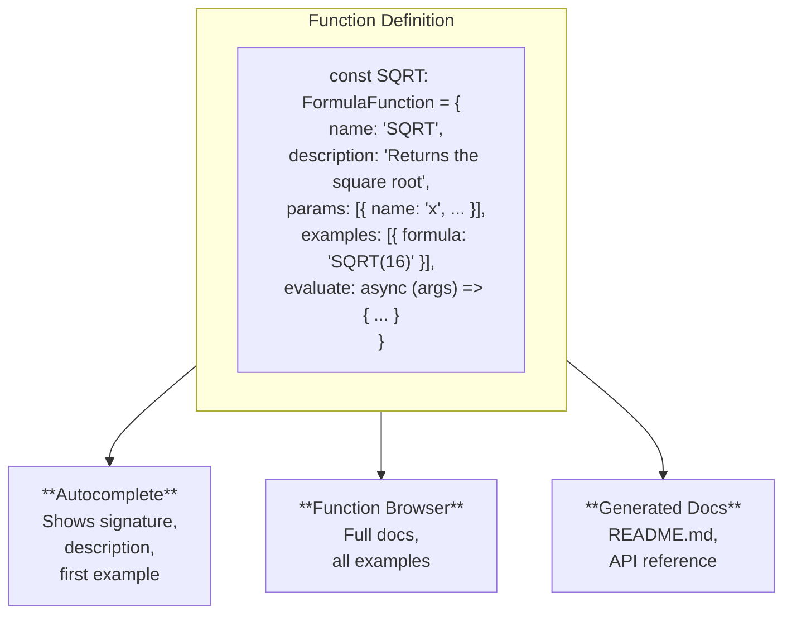
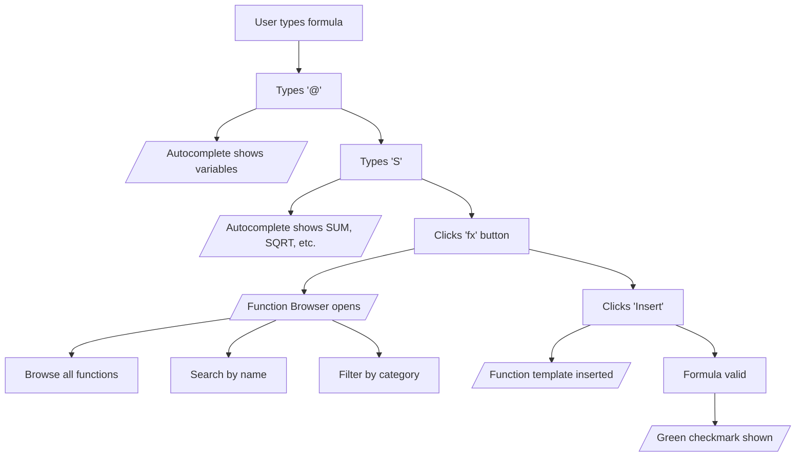
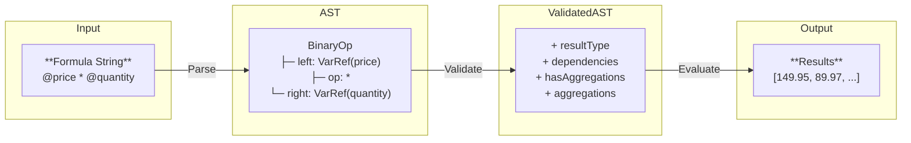

# FormulaQ Architecture

This document describes the architecture and design principles of FormulaQ, a formula evaluation engine for React DataGrids.

---

## Table of Contents

1. [Overview](#overview)
2. [Core Principles](#core-principles)
3. [System Architecture](#system-architecture)
4. [Self-Documenting Functions](#self-documenting-functions)
5. [Help System Design](#help-system-design)
6. [Data Flow](#data-flow)
7. [Extension Points](#extension-points)

---

## Overview

FormulaQ is a TypeScript library that provides:

- **Formula parsing** using Chevrotain
- **Type-safe validation** with semantic analysis
- **Batch evaluation** with chunked execution for large datasets
- **React components** for formula editing with CodeMirror
- **MUI DataGrid integration** for formula columns

### Design Goals

1. **Type Safety** - Full TypeScript support with strict typing
2. **Extensibility** - Easy to add custom functions
3. **Self-Documenting** - Documentation derived from code
4. **Performance** - Chunked evaluation for large datasets
5. **Developer Experience** - Clear APIs and comprehensive tooling

---

## Core Principles

### Single Source of Truth

All function metadata lives in the function definition itself:

```typescript
const SUM: FormulaFunction = {
  name: 'SUM',
  description: 'Calculates the sum of all numeric values',
  params: [{
    name: 'values',
    type: ['number.integer', 'number.float'],
    description: 'Numeric values to sum',
  }],
  returnType: 'number.float',
  isAggregation: true,
  category: 'Aggregation',
  examples: [
    { formula: 'SUM(@sales)', description: 'Total of all sales' },
    { formula: 'SUM(@quantity)', description: 'Count total items' },
  ],

  async evaluate(args, context) {
    // Implementation
  },
};
```

This single definition powers:
- Runtime evaluation
- Validation and type checking
- Editor autocomplete
- Function Browser help dialog
- Generated documentation

### Null Propagation

All operations follow SQL-like null semantics:
- `null + 5` → `null`
- `null == null` → `null` (not `true`)
- Aggregations skip nulls: `SUM([1, null, 3])` → `4`

### Separation of Concerns

Each module has a clear responsibility:

| Module | Responsibility |
|--------|----------------|
| `formula-parser/` | Lexing and parsing formulas to AST |
| `formula-validator/` | Type checking and semantic validation |
| `formula-evaluator/` | Row-level and batch evaluation |
| `functions/` | Function definitions and registry |
| `editor/` | React components for formula editing |
| `datagrid/` | MUI DataGrid integration |

---

## System Architecture

```
┌─────────────────────────────────────────────────────────────────┐
│                        FormulaQ Engine                          │
├─────────────────────────────────────────────────────────────────┤
│                                                                 │
│  ┌──────────────┐  ┌──────────────┐  ┌──────────────────────┐  │
│  │    Parser    │  │  Validator   │  │     Evaluator        │  │
│  │              │  │              │  │                      │  │
│  │  Chevrotain  │──│  Type Check  │──│  Row Evaluator       │  │
│  │  Lexer       │  │  Var Resolve │  │  Batch Evaluator     │  │
│  │  Grammar     │  │  Func Valid  │  │  Aggregation Cache   │  │
│  │  AST Builder │  │  Agg Detect  │  │  Chunked Executor    │  │
│  └──────────────┘  └──────────────┘  └──────────────────────┘  │
│                                                                 │
│  ┌──────────────────────────────────────────────────────────┐  │
│  │                   Function Registry                       │  │
│  │                                                           │  │
│  │  ┌────────────┐ ┌────────────┐ ┌────────────┐ ┌────────┐ │  │
│  │  │ Aggregation│ │    Math    │ │  Logical   │ │ String │ │  │
│  │  │ SUM, AVG   │ │ LOG, POWER │ │ IF, AND    │ │ CONCAT │ │  │
│  │  │ MIN, MAX   │ │ LOG10      │ │ OR, NOT    │ │        │ │  │
│  │  │ COUNT      │ │            │ │ IFNULL     │ │        │ │  │
│  │  │ PERCENTILE │ │            │ │            │ │        │ │  │
│  │  └────────────┘ └────────────┘ └────────────┘ └────────┘ │  │
│  └──────────────────────────────────────────────────────────┘  │
│                                                                 │
└─────────────────────────────────────────────────────────────────┘
                              │
                              ▼
┌─────────────────────────────────────────────────────────────────┐
│                      React Components                            │
├─────────────────────────────────────────────────────────────────┤
│                                                                 │
│  ┌──────────────────────┐  ┌─────────────────────────────────┐ │
│  │    Formula Editor    │  │         Function Browser        │ │
│  │                      │  │                                 │ │
│  │  CodeMirror 6        │  │  Searchable function list       │ │
│  │  Syntax Highlighting │  │  Category filtering             │ │
│  │  Autocomplete        │  │  Parameter documentation        │ │
│  │  Error Markers       │  │  Examples                       │ │
│  │  Validation Status   │  │  Insert at cursor               │ │
│  └──────────────────────┘  └─────────────────────────────────┘ │
│                                                                 │
│  ┌──────────────────────────────────────────────────────────┐  │
│  │                   DataGrid Integration                    │  │
│  │                                                           │  │
│  │  GridVariableProvider    DependencyManager               │  │
│  │  GridEvaluationContext   FormulaColumnDialog             │  │
│  │  useFormulaColumns       Custom Column Menu              │  │
│  └──────────────────────────────────────────────────────────┘  │
│                                                                 │
└─────────────────────────────────────────────────────────────────┘
```

---

## Self-Documenting Functions

### The FunctionInfo Interface

Every function carries its own documentation:

```typescript
interface FunctionInfo {
  // Identity
  name: string;                    // 'SUM'
  category?: string;               // 'Aggregation'

  // Documentation
  description: string;             // 'Calculates the sum...'
  params: readonly ParamDef[];     // Parameter definitions
  returnType: ValueType;           // 'number.float'
  examples?: readonly FunctionExample[];  // Usage examples

  // Behavior flags
  isAggregation: boolean;          // Operates on full column
  isVariadic?: boolean;            // Accepts variable args
  minArgs?: number;                // Minimum argument count
  maxArgs?: number;                // Maximum argument count
}

interface FunctionExample {
  formula: string;                 // '@price * @quantity'
  description: string;             // 'Calculate line total'
}
```

### Why This Matters

| Traditional Approach | FormulaQ Approach |
|---------------------|-------------------|
| Code and docs separate | Docs embedded in code |
| Docs get stale | Docs always accurate |
| Manual sync required | Automatic sync |
| Runtime and docs diverge | Single source of truth |

### Automatic Documentation Flow



---

## Help System Design

### Components

1. **Enhanced Autocomplete**
   - Triggers on `@` for variables, letters for functions
   - Shows category prefix: `[Aggregation] SUM`
   - Displays description and first example
   - Parameter hints after function name

2. **Function Browser Dialog**
   - Opened via "fx" button or keyboard shortcut
   - Searchable by name and description
   - Filterable by category
   - Shows full documentation and all examples
   - "Insert" adds function template to formula

3. **Validation Feedback**
   - Real-time syntax error highlighting
   - Semantic error messages (unknown variable, type mismatch)
   - Status indicator (valid/invalid/validating)

### User Journey



---

## Data Flow

### Parse → Validate → Evaluate



### Aggregation Pre-computation

```
Formula: "@price - AVG(@price)"

Step 1: Detect aggregations           Step 2: Pre-compute           Step 3: Row evaluation

AVG(@price) found                      AVG(@price) = 45.50          Row 0: 29.99 - 45.50 = -15.51
                                       (computed once)               Row 1: 59.99 - 45.50 =  14.49
                                       (cached)                      Row 2: 49.99 - 45.50 =   4.49
                                                                     ...
```

---

## Extension Points

### 1. Custom Functions

Register new functions with the engine:

```typescript
engine.registerFunction({
  name: 'DISCOUNT',
  description: 'Apply percentage discount',
  params: [
    { name: 'price', type: 'number.float', description: 'Original price' },
    { name: 'percent', type: 'number.float', description: 'Discount %' },
  ],
  returnType: 'number.float',
  isAggregation: false,
  category: 'Financial',
  examples: [
    { formula: 'DISCOUNT(@price, 10)', description: '10% off' },
  ],
  async evaluate(args) {
    const price = args[0]?.value as number;
    const percent = args[1]?.value as number;
    if (price === null || percent === null) return null;
    return { type: 'number.float', value: price * (1 - percent / 100) };
  },
});
```

### 2. Custom Variable Providers

Implement `VariableProvider` for custom data sources:

```typescript
const provider: VariableProvider = {
  getVariableInfo(name: string) {
    // Return variable metadata
  },
  getVariables() {
    // Return all available variables
  },
};
```

### 3. Custom Evaluation Contexts

Implement `EvaluationContext` for custom data:

```typescript
const context: EvaluationContext = {
  variables: {
    price: [{ type: 'number.float', value: 29.99 }, ...],
    quantity: [{ type: 'number.integer', value: 5 }, ...],
  },
  rowCount: 100,
};
```

### 4. Editor Extensions

Add CodeMirror extensions for custom behavior:

```typescript
const customExtension = EditorView.updateListener.of((update) => {
  // Custom editor behavior
});
```

---

## Related Documentation

- [Extending FormulaQ](./extending-formulaq.md) - Adding custom functions and maintenance guidelines
- [Technical Implementation](./technical-implementation.md) - Implementation details
- [API Reference](../src/core/README.md) - Core API documentation
