# FormulaQ Specification

## Extensible Formula Engine for React Applications

**Version:** 1.0 (MVP)  
**Status:** Draft Specification  
**Audience:** Development Team, Computational Chemists (End Users)

---

## Table of Contents

1. [Overview](#1-overview)
2. [Syntax & Grammar](#2-syntax--grammar)
3. [Type System](#3-type-system)
4. [FormulaQ Core API](#4-formulaq-core-api)
5. [Function Library](#5-function-library)
6. [Evaluation Model](#6-evaluation-model)
7. [Editor UI/UX](#7-editor-uiux)
8. [Error Handling](#8-error-handling)
9. [Performance & Scalability](#9-performance--scalability)
10. [Technical Architecture](#10-technical-architecture)
11. [Future Roadmap](#11-future-roadmap)
12. [Appendix: OSS Library Candidates](#12-appendix-oss-library-candidates)
13. [Glossary](#13-glossary)
14. [Document History](#14-document-history)

---

## 1. Overview

### 1.1 Purpose

**FormulaQ** is a flexible, reusable formula engine that enables users to define expressions over named variables. The engine is designed to be **context-agnostic** — it can power:

- **MUI DataGrid** — derived columns with row-level and aggregate computations
- **Batch data processing** — transform arrays of data programmatically  
- **Interactive playgrounds** — test and validate formulas in isolation
- **Export/transformation pipelines** — apply formulas during data export
- **Future integrations** — any context where expression evaluation is needed

The primary use case is computational chemistry workflows, with support for RDKit-based molecular property calculations.

### 1.2 Goals

| Goal | Description |
|------|-------------|
| **Decoupled** | Core engine has zero UI dependencies; can run in browser, Node.js, or Web Worker |
| **Usability** | Excel-inspired syntax familiar to scientists; rich editor with autocomplete and syntax highlighting |
| **Correctness** | Strict typing with clear errors; scientific precision prioritized over convenience |
| **Extensibility** | Adding new functions is trivial; architecture supports future async/server-side evaluation |
| **Performance** | Handle datasets from 20 to 20 million rows without freezing UI |
| **Incremental Delivery** | Core engine → Editor UI → DataGrid integration as separate milestones |

### 1.3 Non-Goals (MVP)

- Backend persistence or compute
- Runtime plugin system for user-defined functions
- Date/time data types and functions
- Conditional aggregations (SUMIF, COUNTIF, etc.)
- Comments in formulas
- String manipulation beyond basic concatenation

### 1.4 Architectural Layers

FormulaQ is organized into three distinct layers:

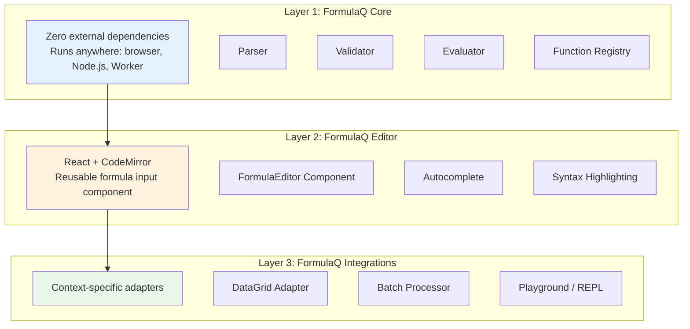

| Layer | Dependencies | Package |
|-------|--------------|---------|
| **FormulaQ Core** | None (pure TypeScript) | `formulaq/core` |
| **FormulaQ Editor** | React, CodeMirror | `formulaq/editor` |
| **FormulaQ Integrations** | Core + Editor + target | `formulaq/datagrid`, `formulaq/playground` |

---

## 2. Syntax & Grammar

### 2.1 Variable References

Variables are referenced using the `@` prefix:

```
@variable_name
@result_data.minimized_affinity
@mol_structure
```

**Rules:**
- Variable names are case-sensitive
- Valid characters: alphanumeric, underscore (`_`), period (`.`)
- No spaces or special characters
- The `@` prefix is mandatory for all variable references
- Periods are part of the identifier (not property access)

**Context mapping:**
| Context | `@name` refers to... |
|---------|---------------------|
| DataGrid | Column named "name" |
| Batch processor | Key "name" in each record |
| Playground | Variable "name" in test context |

**Rationale:** The `@` prefix provides unambiguous parsing without requiring the parser to know all variable names upfront. Square brackets `[]` are reserved for potential future syntax extensions (e.g., array indexing).

### 2.2 Function Calls

Functions use standard call syntax:

```
FUNCTION_NAME(arg1, arg2, ...)
```

**Rules:**
- Function names are case-sensitive (e.g., `MAX` ≠ `max`)
- Parentheses are required, even for zero-argument functions
- Arguments are comma-separated
- Nested function calls are supported to arbitrary depth

### 2.3 Operators

#### Arithmetic Operators

| Operator | Description | Example | Precedence |
|----------|-------------|---------|------------|
| `^` | Exponentiation | `@x ^ 2` | 1 (highest) |
| `*` | Multiplication | `@x * @y` | 2 |
| `/` | Division | `@x / @y` | 2 |
| `%` | Modulo | `@x % 10` | 2 |
| `+` | Addition | `@x + @y` | 3 |
| `-` | Subtraction | `@x - @y` | 3 |
| `-` | Unary negation | `-@x` | 1 |
| `+` | Unary plus (no-op) | `+@x` | 1 |

**Precedence:** Standard mathematical precedence. Exponentiation (`^`) is right-associative.

```
2 + 3 * 4       → 14 (not 20)
2 ^ 3 ^ 2       → 512 (2^9, right-associative)
-2 ^ 2          → -4 (negation after exponentiation)
```

#### Comparison Operators

| Operator | Description | Example |
|----------|-------------|---------|
| `==` | Equal | `@x == @y` |
| `!=` | Not equal | `@x != @y` |
| `<>` | Not equal (alt) | `@x <> @y` |
| `<` | Less than | `@x < @y` |
| `>` | Greater than | `@x > @y` |
| `<=` | Less or equal | `@x <= @y` |
| `>=` | Greater or equal | `@x >= @y` |

**Result:** Boolean (`TRUE` or `FALSE`)

#### String Concatenation

| Operator | Description | Example |
|----------|-------------|---------|
| `&` | Concatenate | `@first_name & " " & @last_name` |

Also available via `CONCAT()` function.

### 2.4 Literals

#### Numeric Literals

```
42
3.14159
-1.5e10
.5
```

#### String Literals

Both single and double quotes are supported:

```
"hello world"
'hello world'
```

Escape sequences:
- `\\` → backslash
- `\'` → single quote (in single-quoted strings)
- `\"` → double quote (in double-quoted strings)

#### Boolean Literals

```
TRUE
FALSE
```

### 2.5 Built-in Constants

| Constant | Value | Description |
|----------|-------|-------------|
| `PI` | 3.141592653589793 | Pi |
| `E` | 2.718281828459045 | Euler's number |
| `TRUE` | true | Boolean true |
| `FALSE` | false | Boolean false |

### 2.6 Parentheses

Parentheses override precedence and group expressions:

```
(@colA + @colB) * 2
((@x + @y) / 2) ^ 2
IF(@score > 0, LOG(@score), 0)
```

Arbitrary nesting depth is supported.

### 2.7 Multi-line Formulas

Formulas may span multiple lines for readability:

```
IF(
  @value > 100,
  @value * 0.9,
  @value
)
```

Whitespace (spaces, tabs, newlines) is ignored except within string literals.

### 2.8 Grammar (EBNF)

```ebnf
formula      = expression ;

expression   = comparison ;

comparison   = additive { comp_op additive } ;
comp_op      = "==" | "!=" | "<>" | "<" | ">" | "<=" | ">=" ;

additive     = multiplicative { ("+" | "-" | "&") multiplicative } ;
multiplicative = unary { ("*" | "/" | "%") unary } ;

unary        = ("-" | "+") unary | power ;
power        = primary ["^" unary] ;  (* right-associative *)

primary      = literal
             | constant
             | variable_ref
             | function_call
             | "(" expression ")" ;

variable_ref = "@" identifier ;
identifier   = (letter | "_") { letter | digit | "_" | "." } ;

function_call = function_name "(" [ arg_list ] ")" ;
function_name = letter { letter | digit | "_" } ;
arg_list     = expression { "," expression } ;

literal      = number | string | boolean ;
number       = ["-"] digit+ ["." digit+] [("e"|"E") ["+"|"-"] digit+] ;
string       = '"' { any_char_except_quote | escape } '"'
             | "'" { any_char_except_quote | escape } "'" ;
boolean      = "TRUE" | "FALSE" ;

constant     = "PI" | "E" | "TRUE" | "FALSE" ;
```

**Note:** Logical operations (`AND`, `OR`, `NOT`) are implemented as functions, not operators:
```
AND(@a > 0, @b > 0, @c > 0)   ✓ Correct (variadic function)
@a > 0 AND @b > 0             ✗ Invalid (no keyword operators)

NOT(@x > 5)                    ✓ Correct (function)
NOT @x > 5                     ✗ Invalid (no prefix operator)
```

### 2.9 AST Structure Example

For the formula: `(@score - AVG(@score)) / 100`

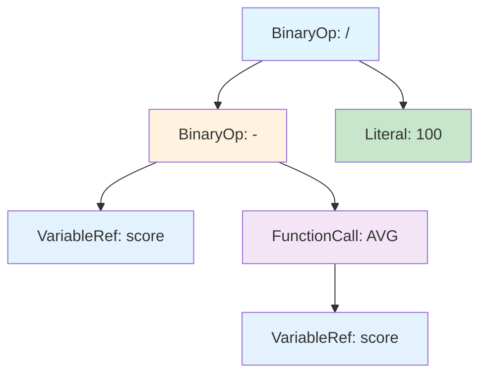

**AST JSON representation:**

```json
{
  "type": "BinaryOp",
  "operator": "/",
  "left": {
    "type": "BinaryOp",
    "operator": "-",
    "left": { "type": "VariableRef", "name": "score" },
    "right": {
      "type": "FunctionCall",
      "name": "AVG",
      "args": [
        { "type": "VariableRef", "name": "score" }
      ]
    }
  },
  "right": { "type": "Literal", "value": 100, "valueType": "number.integer" }
}
```

---

## 3. Type System

### 3.1 Data Types

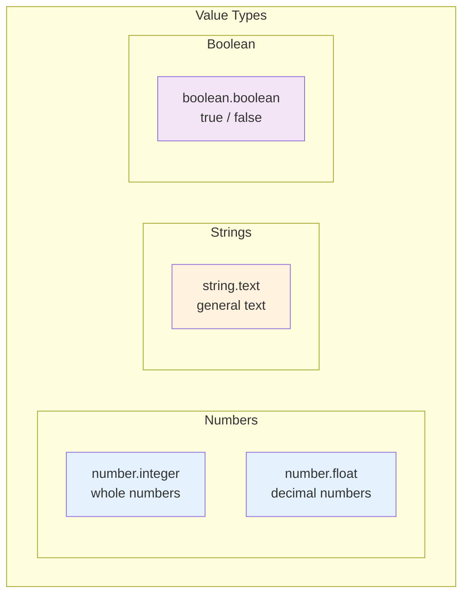

| Type | Description | Examples |
|------|-------------|----------|
| `number.integer` | Whole numbers | `42`, `-7`, `0` |
| `number.float` | IEEE 754 double-precision float | `3.14`, `-1e10`, `0.5` |
| `string.text` | UTF-8 text | `"hello"`, `'world'` |
| `boolean.boolean` | True or false | `TRUE`, `FALSE` |

**Nullability:** Each variable/column has a `nullable: boolean` property rather than a separate null type. Null values are represented as `value: null` within the Value interface.

### 3.2 Null Handling

**Null propagation:** Most operations return `null` if any operand is `null`:

```
@colA + @colB   → null if either is null
@colA * 2       → null if @colA is null
```

**Aggregations skip nulls:**

```
SUM(@col)       → sum of non-null values
AVG(@col)       → average of non-null values
COUNT(@col)     → count of non-null values
MIN(@col)       → minimum of non-null values
MAX(@col)       → maximum of non-null values
```

**All-null aggregation:** When all values are null, aggregations return `null` (Excel-like behavior).

```
AVG(@col)       → null if all values are null (not #DIV/0!)
SUM(@col)       → null if all values are null
MIN(@col)       → null if all values are null
```

**Comparison with null operands:** Following SQL three-valued logic, comparison operators return `null` when either operand is `null`:

```
null == null    → null (not true)
null != 5       → null
@x > 0          → null if @x is null
```

**Empty string is NOT null:** Empty string (`""`) is a valid string value, distinct from `null`.

```
"" == ""        → TRUE
"" & "hello"    → "hello"
IFNULL("", "default")  → "" (empty string is not null)
```

### 3.3 Type Coercion

**Strict typing:** No implicit coercion. Type mismatches produce errors.

| Expression | Result |
|------------|--------|
| `"5" + 3` | Error: cannot add string and number |
| `5 + "hello"` | Error: cannot add number and string |
| `TRUE + 1` | Error: cannot add boolean and number |
| `@num_col & "suffix"` | Error: `&` requires string operands |
| `CONCAT(@num_col, "suffix")` | Error: CONCAT requires string arguments |

**Rationale:** Scientific data integrity requires explicit operations. Silent coercion can mask data quality issues.

**Explicit conversion:** Use `IF` for type conversion when needed:
```
IF(TRUE, 1, 0)                    → 1 (boolean to number)
IF(@num > 0, "positive", "zero")  → string result based on number
```

### 3.4 Boolean Semantics

Booleans are distinct from numbers:

- `TRUE` and `FALSE` are not `1` and `0`
- Use `IF(condition, 1, 0)` for numeric conversion
- Comparison operators return boolean
- Logical functions (`AND`, `OR`, `NOT`) require boolean arguments

---

## 4. FormulaQ Core API

This section defines the interfaces and contracts for the decoupled FormulaQ engine. These abstractions allow the engine to operate independently of any specific UI framework or data source.

### 4.1 Architecture Overview

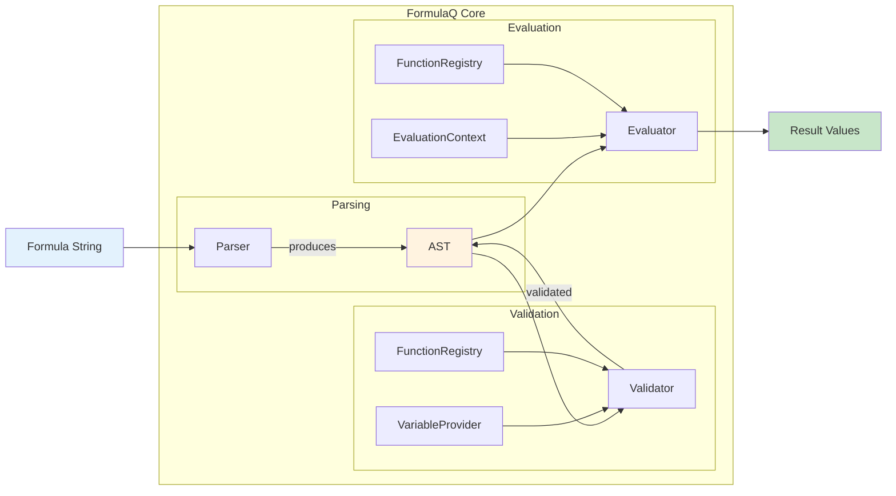

### 4.2 VariableProvider Interface

The `VariableProvider` supplies information about available variables at **parse/validation time**. This enables autocomplete and type checking without requiring actual data.

```typescript
/**
 * Provides metadata about available variables.
 * Used for autocomplete, validation, and type checking.
 */
interface VariableProvider {
  /**
   * List all available variable names with metadata.
   * Used for autocomplete suggestions.
   */
  getVariables(): VariableInfo[];
  
  /**
   * Check if a variable exists.
   * Used during validation to detect unknown variable references.
   */
  hasVariable(name: string): boolean;
  
  /**
   * Get type information for a variable.
   * Used for type checking during validation.
   * Returns undefined if variable doesn't exist.
   */
  getVariableType(name: string): ValueType | undefined;
  
  /**
   * Check if a variable can contain null values.
   */
  isNullable(name: string): boolean;
}
```

**Example implementations:**

```typescript
// DataGrid adapter
class DataGridVariableProvider implements VariableProvider {
  constructor(private columns: GridColDef[]) {}
  
  getVariables(): VariableInfo[] {
    return this.columns.map(col => ({
      name: col.field,
      type: this.inferType(col),
      nullable: col.nullable ?? true,
      description: col.description,
      group: 'Columns'
    }));
  }
  
  hasVariable(name: string): boolean {
    return this.columns.some(col => col.field === name);
  }
  
  getVariableType(name: string): ValueType | undefined {
    const col = this.columns.find(c => c.field === name);
    return col ? this.inferType(col) : undefined;
  }
  
  isNullable(name: string): boolean {
    const col = this.columns.find(c => c.field === name);
    return col?.nullable ?? true;
  }
}

// Playground adapter
class PlaygroundVariableProvider implements VariableProvider {
  constructor(private variables: Record<string, { type: ValueType; nullable: boolean }>) {}
  
  getVariables(): VariableInfo[] {
    return Object.entries(this.variables).map(([name, info]) => ({
      name,
      type: info.type,
      nullable: info.nullable,
      group: 'Test Variables'
    }));
  }
  
  hasVariable(name: string): boolean {
    return name in this.variables;
  }
  
  getVariableType(name: string): ValueType | undefined {
    return this.variables[name]?.type;
  }
  
  isNullable(name: string): boolean {
    return this.variables[name]?.nullable ?? true;
  }
}
```

### 4.3 EvaluationContext Interface

The `EvaluationContext` provides actual values at **evaluation time**. All variables are provided as arrays, enabling both row-level and aggregation operations.

```typescript
/**
 * Provides variable values for evaluation.
 * All variables are arrays to support both row-level and aggregation operations.
 */
interface EvaluationContext {
  /**
   * Variable values as arrays.
   * Each key is a variable name (without @ prefix).
   * Each value is an array of values for that variable.
   * 
   * For row-level evaluation: access variables[name][currentIndex]
   * For aggregations: access variables[name] (full array)
   */
  variables: Record<string, Value[]>;
  
  /**
   * Current row index for row-level operations.
   * Used when evaluating formulas row-by-row.
   * If undefined, only aggregations can be evaluated.
   */
  currentIndex?: number;
  
  /**
   * Total number of rows.
   * Convenience property: Object.values(variables)[0]?.length ?? 0
   */
  rowCount: number;
  
  /**
   * Abort signal for cancellation support.
   * Long-running evaluations should check this periodically.
   */
  signal?: AbortSignal;
  
  /**
   * Progress callback for long operations.
   * Called with (completedRows, totalRows).
   */
  onProgress?: (completed: number, total: number) => void;
}

/**
 * Hierarchical type system for values.
 */
type ValueType =
  | 'number.integer'    // Whole numbers
  | 'number.float'      // Decimal numbers
  | 'string.text'       // General text
  | 'boolean.boolean';  // True/false

/**
 * A single value with its type.
 */
interface Value {
  type: ValueType;
  value: number | string | boolean | null;  // null represents missing value
}

/**
 * Variable metadata including nullability.
 */
interface VariableInfo {
  /** Variable name (without @ prefix) */
  name: string;
  
  /** Data type of the variable */
  type: ValueType;
  
  /** Whether this variable can contain null values */
  nullable: boolean;
  
  /** Optional description for autocomplete/tooltips */
  description?: string;
  
  /** Optional grouping for autocomplete organization */
  group?: string;
}
```

**Example contexts:**

```typescript
// Single evaluation (scalar mode) - array of length 1
const scalarContext: EvaluationContext = {
  variables: {
    x: [{ type: 'number.integer', value: 10 }],
    y: [{ type: 'number.integer', value: 20 }],
  },
  currentIndex: 0,
  rowCount: 1
};

// Batch evaluation (DataGrid mode)
const batchContext: EvaluationContext = {
  variables: {
    score: [
      { type: 'number.float', value: 85.5 },
      { type: 'number.float', value: 92.0 },
      { type: 'number.float', value: null },  // null value
      // ... potentially millions of rows
    ],
    name: [
      { type: 'string.text', value: 'Alice' },
      { type: 'string.text', value: 'Bob' },
      { type: 'string.text', value: 'Carol' },
    ]
  },
  rowCount: 3,
  signal: abortController.signal,
  onProgress: (done, total) => setProgress(done / total)
};
```

### 4.4 FormulaQ Engine Interface

```typescript
/**
 * Main FormulaQ engine interface.
 * Stateless - all state is passed via parameters.
 */
interface FormulaQEngine {
  /**
   * Parse a formula string into an AST.
   * Throws SyntaxError if formula is malformed.
   */
  parse(formula: string): ASTNode;
  
  /**
   * Validate an AST against a variable provider.
   * Checks: unknown variables, type mismatches, invalid function calls.
   * Throws SemanticError if validation fails.
   */
  validate(ast: ASTNode, provider: VariableProvider): ValidatedAST;
  
  /**
   * Evaluate a single row.
   * Returns the result value for the row at context.currentIndex.
   * Returns null for runtime errors (e.g., division by zero).
   *
   * Note: The implementation accepts `string | ASTNode | ValidatedAST` for
   * convenience, automatically parsing and validating as needed.
   */
  evaluateRow(ast: ValidatedAST, context: EvaluationContext): Promise<Value>;
  
  /**
   * Evaluate all rows, returning results and any runtime errors.
   * Does NOT throw on runtime errors - collects them instead.
   * Handles aggregations, progress reporting, and cancellation.
   */
  evaluateBatch(ast: ValidatedAST, context: EvaluationContext): Promise<BatchResult>;
  
  /**
   * Convenience method: parse + validate + evaluateBatch.
   */
  execute(
    formula: string, 
    provider: VariableProvider, 
    context: EvaluationContext
  ): Promise<BatchResult>;
  
  /**
   * Get all registered functions (for autocomplete).
   */
  getFunctions(): FunctionInfo[];
  
  /**
   * Register a custom function.
   */
  registerFunction(fn: FormulaFunction): void;
  
  /**
   * Extract variable references from an AST.
   * Used for dependency tracking.
   */
  getDependencies(ast: ASTNode): string[];
}

/**
 * Result of batch evaluation, including collected errors.
 */
interface BatchResult {
  /** Result values, one per row. Null for rows with errors. */
  values: Value[];
  
  /** Runtime errors collected during evaluation. */
  errors: RuntimeError[];
  
  /** Whether any errors occurred */
  hasErrors: boolean;
  
  /** Count of successful evaluations */
  successCount: number;
  
  /** Count of failed evaluations */
  errorCount: number;
}

/**
 * Runtime error with full context for debugging.
 */
interface RuntimeError {
  /** Row index where error occurred */
  rowIndex: number;
  
  /** Variable name involved (if applicable) */
  variableName?: string;
  
  /** Error code for programmatic handling */
  code: RuntimeErrorCode;
  
  /** Human-readable error message */
  message: string;
  
  /** Additional details (e.g., the actual value that caused the error) */
  details?: Record<string, unknown>;
}

type RuntimeErrorCode = 
  | 'DIV_BY_ZERO'       // Division by zero
  | 'INVALID_SMILES'    // Invalid SMILES string
  | 'DOMAIN_ERROR'      // Math domain error (e.g., LOG of negative)
  | 'OVERFLOW'          // Numeric overflow
  | 'TYPE_ERROR'        // Unexpected type at runtime
  | 'NULL_ERROR';       // Null in non-nullable context
```

### 4.5 Evaluation Modes

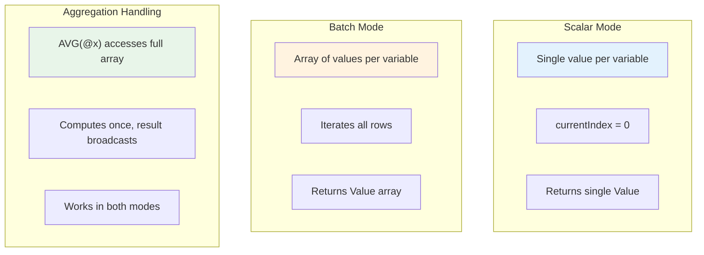

**Scalar Mode:**
```typescript
const engine = createFormulaEngine();
const ast = engine.parse('@x + @y');
const validated = engine.validate(ast, provider);

const result = engine.evaluateRow(validated, {
  variables: {
    x: [{ type: 'number', value: 10 }],
    y: [{ type: 'number', value: 20 }],
  },
  currentIndex: 0,
  rowCount: 1
});
// result = { type: 'number', value: 30 }
```

**Batch Mode:**
```typescript
const results = await engine.evaluateBatch(validated, {
  variables: {
    x: [{ type: 'number', value: 10 }, { type: 'number', value: 20 }],
    y: [{ type: 'number', value: 1 }, { type: 'number', value: 2 }],
  },
  rowCount: 2
});
// results = [
//   { type: 'number', value: 11 },
//   { type: 'number', value: 22 }
// ]
```

**Aggregation in both modes:**
```typescript
// Formula: @x / AVG(@x)
// Scalar mode (1 element): AVG([10]) = 10, result = 10/10 = 1
// Batch mode (3 elements): AVG([10,20,30]) = 20
//   Row 0: 10/20 = 0.5
//   Row 1: 20/20 = 1.0
//   Row 2: 30/20 = 1.5
```

### 4.6 AST Node Types

```typescript
type ASTNode =
  | LiteralNode
  | VariableRefNode
  | BinaryOpNode
  | UnaryOpNode
  | FunctionCallNode;

interface LiteralNode {
  type: 'Literal';
  valueType: ValueType;
  value: number | string | boolean | null;
}

interface VariableRefNode {
  type: 'VariableRef';
  name: string;  // Without @ prefix
}

interface BinaryOpNode {
  type: 'BinaryOp';
  operator: '+' | '-' | '*' | '/' | '^' | '%' | '&' 
          | '==' | '!=' | '<>' | '<' | '>' | '<=' | '>=';
  left: ASTNode;
  right: ASTNode;
}

interface UnaryOpNode {
  type: 'UnaryOp';
  operator: '-' | '+';  // Numeric negation/plus only; NOT is a function
  operand: ASTNode;
}

interface FunctionCallNode {
  type: 'FunctionCall';
  name: string;
  args: ASTNode[];
}

// After validation, nodes are annotated with type info
interface ValidatedAST {
  root: ASTNode;
  resultType: ValueType;
  dependencies: string[];      // Variable names referenced
  hasAggregations: boolean;    // Contains AVG, SUM, etc.
  aggregations: string[];      // List of aggregation function calls
}
```

### 4.7 Error Types

```typescript
/**
 * Base class for all FormulaQ errors.
 */
class FormulaError extends Error {
  constructor(
    message: string,
    public code: string,
    public position?: { start: number; end: number }
  ) {
    super(message);
  }
}

/**
 * Parsing failed - formula is malformed.
 * Examples: unexpected token, missing parenthesis
 */
class SyntaxError extends FormulaError {}

/**
 * Validation failed - formula is syntactically valid but semantically incorrect.
 * Examples: unknown variable, type mismatch, unknown function
 */
class SemanticError extends FormulaError {}

// RuntimeError is defined in §4.4 as part of BatchResult
// Runtime errors are collected, not thrown, during batch evaluation
```

**Error handling strategy:**

| Error Type | When Detected | Behavior |
|------------|---------------|----------|
| `SyntaxError` | `parse()` | Thrown immediately |
| `SemanticError` | `validate()` | Thrown immediately |
| `RuntimeError` | `evaluateBatch()` | Collected in `BatchResult.errors`, evaluation continues |

---

## 5. Function Library

### Function Categories Overview

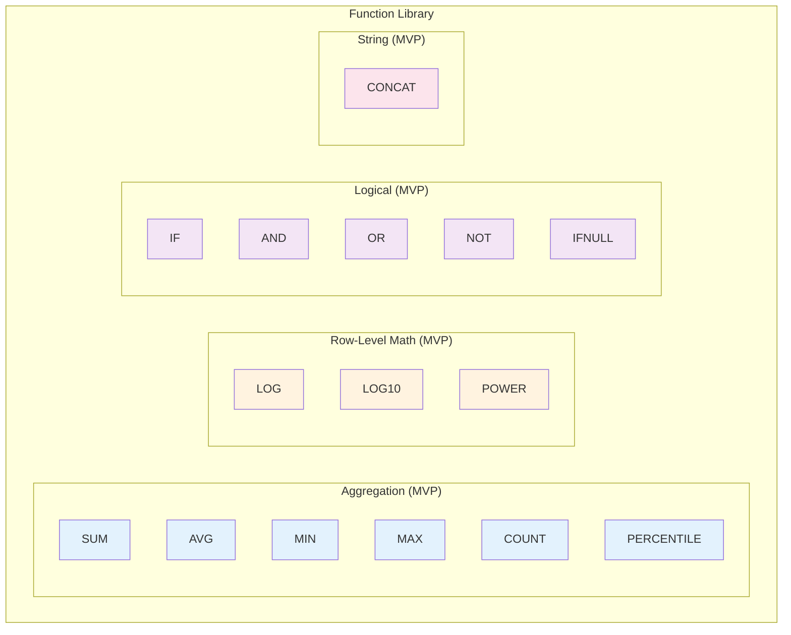

### 5.1 Aggregation Functions

Aggregations operate on entire variable arrays and return a single scalar value that broadcasts to all rows.

| Function | Signature | Description |
|----------|-----------|-------------|
| `SUM` | `SUM(@col) → number` | Sum of non-null values |
| `AVG` | `AVG(@col) → number` | Arithmetic mean of non-null values |
| `MIN` | `MIN(@col) → number` | Minimum non-null value |
| `MAX` | `MAX(@col) → number` | Maximum non-null value |
| `COUNT` | `COUNT(@col) → number` | Count of non-null values |
| `PERCENTILE` | `PERCENTILE(@col, k) → number` | k-th percentile (k in 0-100) |

**All-null behavior (Excel-like):**
- `SUM(@col)` → `null` when all values are null
- `AVG(@col)` → `null` when all values are null
- `MIN(@col)` → `null` when all values are null
- `MAX(@col)` → `null` when all values are null
- `COUNT(@col)` → `0` when all values are null

**Broadcast behavior:**

```
@value / MAX(@value)   → Each row's value divided by column maximum
@score - AVG(@score)   → Deviation from mean for each row
SUM(@quantity) * @price → Total quantity multiplied by each row's price
```

### 5.2 Row-Level Math Functions

| Function | Signature | Description |
|----------|-----------|-------------|
| `LOG` | `LOG(x) → number` | Natural logarithm (ln) |
| `LOG10` | `LOG10(x) → number` | Base-10 logarithm |
| `POWER` | `POWER(x, n) → number` | x raised to power n (same as `x ^ n`) |

**Domain errors:**
- `LOG(0)` → `null` (undefined)
- `LOG(-1)` → `null` (undefined for real numbers)
- `POWER(-1, 0.5)` → `null` (complex result)

### 5.3 Logical Functions

| Function | Signature | Description |
|----------|-----------|-------------|
| `IF` | `IF(condition, then_value, else_value) → any` | Conditional expression |
| `AND` | `AND(cond1, cond2, ...) → boolean` | True if all conditions true |
| `OR` | `OR(cond1, cond2, ...) → boolean` | True if any condition true |
| `NOT` | `NOT(condition) → boolean` | Logical negation |
| `IFNULL` | `IFNULL(value, default) → any` | Return default if value is null |

**Examples:**

```
IF(@score > 50, "pass", "fail")
AND(@age >= 18, @consent == TRUE)
IFNULL(@optional_value, 0)
```

### 5.4 String Functions

| Function | Signature | Description |
|----------|-----------|-------------|
| `CONCAT` | `CONCAT(s1, s2, ...) → string` | Concatenate strings |

**Note:** The `&` operator is equivalent to `CONCAT()`.

### 5.5 Function Registry Interface

For extensibility, functions are registered via a standard interface:

```typescript
interface FormulaFunction {
  /** Unique function name (case-sensitive) */
  name: string;

  /** Human-readable description for autocomplete/docs */
  description: string;

  /** Parameter definitions for validation and hints */
  params: ParamDef[];

  /** Return type */
  returnType: ValueType;

  /**
   * Is this an aggregation function?
   * Aggregations receive entire variable arrays via context.
   * Row-level functions receive evaluated single values.
   */
  isAggregation: boolean;

  /** Category for organizing in autocomplete (e.g., 'Aggregation', 'Math', 'Logical') */
  category?: string;

  /**
   * Usage examples for documentation and the function browser.
   * Each example shows a practical use case with formula and description.
   */
  examples?: FunctionExample[];

  /**
   * Evaluation function.
   * Always async to support future server-side evaluation.
   *
   * For row-level functions:
   *   - args contains evaluated Values for current row
   *
   * For aggregation functions:
   *   - args contains VariableRef names (strings) for columns to aggregate
   *   - Use context.variables[name] to access full arrays
   *
   * @param args - Evaluated argument values OR variable names for aggregations
   * @param context - Full evaluation context with all variable data
   * @returns Result value or null
   */
  evaluate: (args: Value[], context: EvaluationContext) => Promise<Value | null>;
}

interface FunctionExample {
  /** The formula string demonstrating the function usage */
  formula: string;
  /** Human-readable description of what this example does */
  description: string;
}

interface ParamDef {
  name: string;
  type: ValueType | ValueType[] | 'any';  // Allowed types, 'any' for flexible params
  description: string;
  optional?: boolean;
  defaultValue?: Value;
}
```

**Aggregation function parameter handling:**

For aggregation functions like `AVG(@score)`:
1. During evaluation, the AST walker identifies this as an aggregation
2. The aggregation is computed ONCE before row-level evaluation
3. The result is cached and used as a scalar in row-level expressions

```typescript
// Conceptual evaluation flow for: @value / AVG(@value)
// 
// Phase 1: Compute aggregations
const avgValue = functions['AVG'].evaluate(
  [{ type: 'string.text', value: 'value' }],  // Variable name as arg
  context  // Full context with all data
);
// avgValue = { type: 'number.float', value: 50.0 }
//
// Phase 2: Row-level evaluation with cached aggregation
for (let i = 0; i < context.rowCount; i++) {
  const rowValue = context.variables['value'][i];
  result[i] = rowValue.value / avgValue.value;
}
```

**Example registration:**

```typescript
registerFunction({
  name: 'AVG',
  description: 'Calculate arithmetic mean of values',
  params: [
    { name: 'values', type: ['number.integer', 'number.float'], description: 'Numeric values' }
  ],
  returnType: 'number.float',
  isAggregation: true,
  category: 'Aggregation',
  examples: [
    { formula: 'AVG(@score)', description: 'Average of all scores' },
    { formula: '@value / AVG(@value)', description: 'Normalize values to mean' }
  ],
  evaluate: async ([varNameValue], context) => {
    const varName = varNameValue.value as string;
    const values = context.variables[varName];
    const nonNull = values.filter(v => v.value !== null);
    if (nonNull.length === 0) return { type: 'number.float', value: null };
    const sum = nonNull.reduce((acc, v) => acc + (v.value as number), 0);
    return { type: 'number.float', value: sum / nonNull.length };
  }
});
```

---

## 6. Evaluation Model

### 6.1 Evaluation Modes

#### Row-Level Evaluation

Most expressions evaluate per-row:

```
@colA + @colB           → Computed for each row independently
LOG(@value)             → Computed for each row
IF(@x > 0, @x, 0)       → Computed for each row
```

#### Aggregation with Broadcast

Aggregation functions compute once and broadcast:

```
@value / AVG(@value)
```

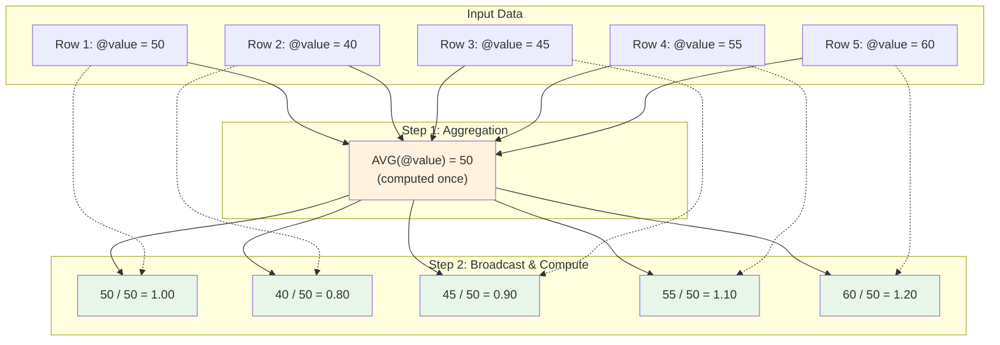

Evaluation:
1. Compute `AVG(@value)` → single scalar (e.g., `50`)
2. For each row: compute `@value / 50`

#### Mixed Expressions

Expressions can combine both modes:

```
(@score - AVG(@score)) / PERCENTILE(@score, 75)
```

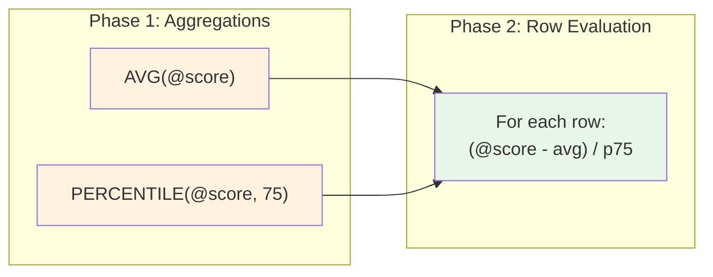

Evaluation:
1. Compute all aggregations first (single pass over data)
2. Then evaluate row-level expression with aggregation results as constants

### 6.2 Dependency Graph

Formula columns can reference other formula columns:

```
FormulaCol1 = @colA + @colB
FormulaCol2 = @FormulaCol1 * 2
FormulaCol3 = @FormulaCol2 / AVG(@FormulaCol1)
```

#### Dependency Graph Visualization

```mermaid
flowchart TD
    subgraph Source Columns
        A[colA]
        B[colB]
    end
    
    subgraph Formula Columns
        F1[FormulaCol1<br/>@colA + @colB]
        F2[FormulaCol2<br/>@FormulaCol1 * 2]
        F3[FormulaCol3<br/>@FormulaCol2 / AVG‹@FormulaCol1›]
    end
    
    A --> F1
    B --> F1
    F1 --> F2
    F1 --> F3
    F2 --> F3
    
    style A fill:#e3f2fd
    style B fill:#e3f2fd
    style F1 fill:#fff3e0
    style F2 fill:#fff3e0
    style F3 fill:#fff3e0
```

#### Evaluation Order (Topological Sort)

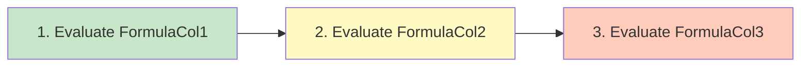

**Dependency resolution:**
1. Build directed acyclic graph (DAG) of formula dependencies
2. Topological sort to determine evaluation order
3. Evaluate in order, caching intermediate results

**Circular reference detection:**
- Detect cycles during formula creation/edit
- Reject formulas that would create cycles
- Display clear error: "Circular reference: FormulaCol1 → FormulaCol2 → FormulaCol1"

#### Circular Reference Example (Invalid)

```mermaid
flowchart LR
    F1[FormulaCol1<br/>@FormulaCol2 + 1] --> F2[FormulaCol2<br/>@FormulaCol1 * 2]
    F2 --> F1
    
    style F1 fill:#ffcdd2
    style F2 fill:#ffcdd2
```

### 6.3 Materialization Strategy

**Immediate materialization:** When a formula is created or modified, results are computed and stored immediately.

**MVP approach:** Column-level recomputation
- Any change triggers full column recalculation
- All dependent columns are recalculated in topological order
- Progress bar shown for large datasets

**Future optimization:** Row-level incremental updates
- Track which rows changed in source columns
- Only recompute affected rows in formula columns
- Propagate changes through dependency graph

### 6.4 Recomputation Triggers

| Trigger | Scope |
|---------|-------|
| Formula created | New column only |
| Formula modified | Modified column + all dependents |
| Source column cell edited | All formula columns depending on source + their dependents |
| Source column deleted | Blocked (must remove dependents first) |
| Source column renamed | Auto-update all formulas referencing it |

#### Recomputation Flow

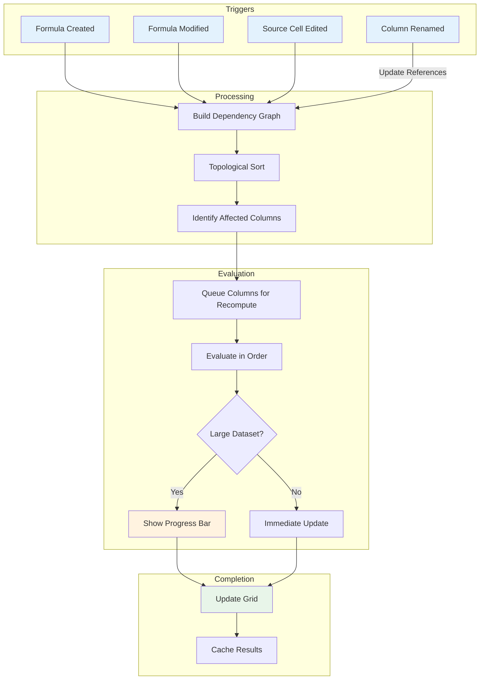

#### Column Deletion Flow

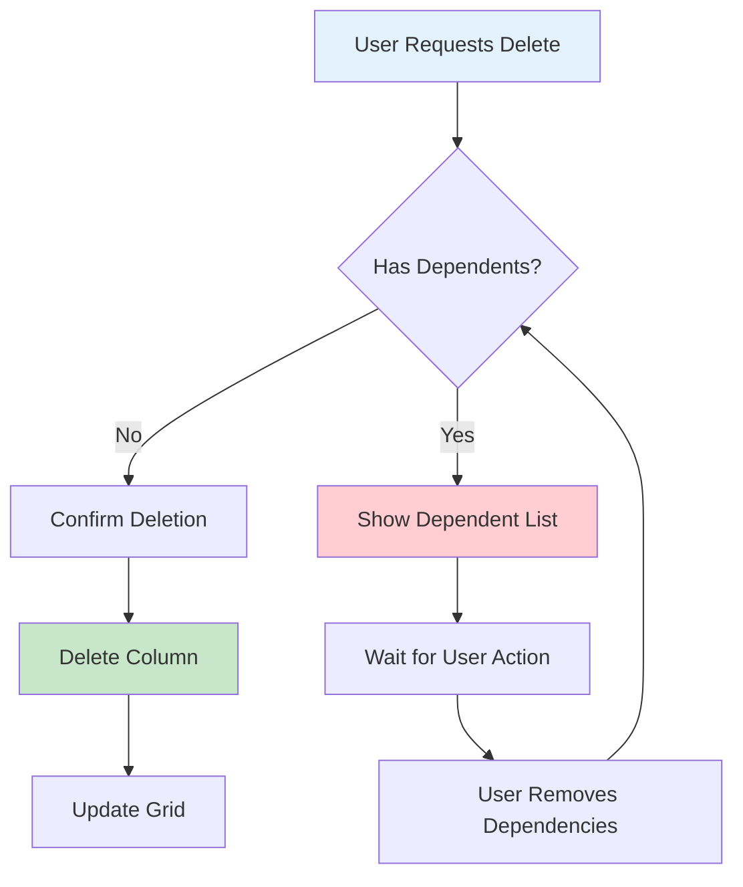

---

## 7. Editor UI/UX

### 7.1 Entry Point

**Toolbar button:** "+ Formula Column" button in the DataGrid toolbar.

### 7.2 Editor Dialog

Modal dialog with the following components:

#### Dialog Component Structure

```mermaid
flowchart TD
    subgraph Dialog[Formula Editor Dialog]
        Header[Dialog Header<br/>'Create Formula Column']
        
        subgraph Form[Form Section]
            NameInput[Column Name Input]
            Editor[CodeMirror Editor]
            Status[Validation Status]
        end
        
        subgraph Preview[Preview Section]
            PreviewTable[Preview Table<br/>First 10 rows]
        end
        
        Actions[Action Buttons<br/>Cancel | Create]
    end
    
    Header --> Form
    Form --> Preview
    Preview --> Actions
    
    style Dialog fill:#fafafa
    style Editor fill:#e3f2fd
    style PreviewTable fill:#f5f5f5
```

#### Dialog Wireframe

```
┌─────────────────────────────────────────────────────────────────┐
│  Create Formula Column                                     [X]  │
├─────────────────────────────────────────────────────────────────┤
│                                                                 │
│  Column Name:  [________________________]                       │
│                                                                 │
│  Formula:                                                       │
│  ┌─────────────────────────────────────────────────────────┐   │
│  │ @value / AVG(@value) * 100                              │   │
│  │                                                         │   │
│  │                                                         │   │
│  └─────────────────────────────────────────────────────────┘   │
│                                                                 │
│  ┌─────────────────────────────────────────────────────────┐   │
│  │ ✓ Formula is valid                                      │   │
│  └─────────────────────────────────────────────────────────┘   │
│                                                                 │
│  Preview (first 10 rows):                                       │
│  ┌─────────────┬─────────────┬─────────────────┐               │
│  │ @value      │ AVG(@value) │ Result          │               │
│  ├─────────────┼─────────────┼─────────────────┤               │
│  │ 50          │ 45          │ 111.11          │               │
│  │ 40          │ 45          │ 88.89           │               │
│  │ 45          │ 45          │ 100.00          │               │
│  │ ...         │ ...         │ ...             │               │
│  └─────────────┴─────────────┴─────────────────┘               │
│                                                                 │
│                              [Cancel]  [Create Column]          │
└─────────────────────────────────────────────────────────────────┘
```

### 7.3 Formula Editor Features

#### Editor State Machine

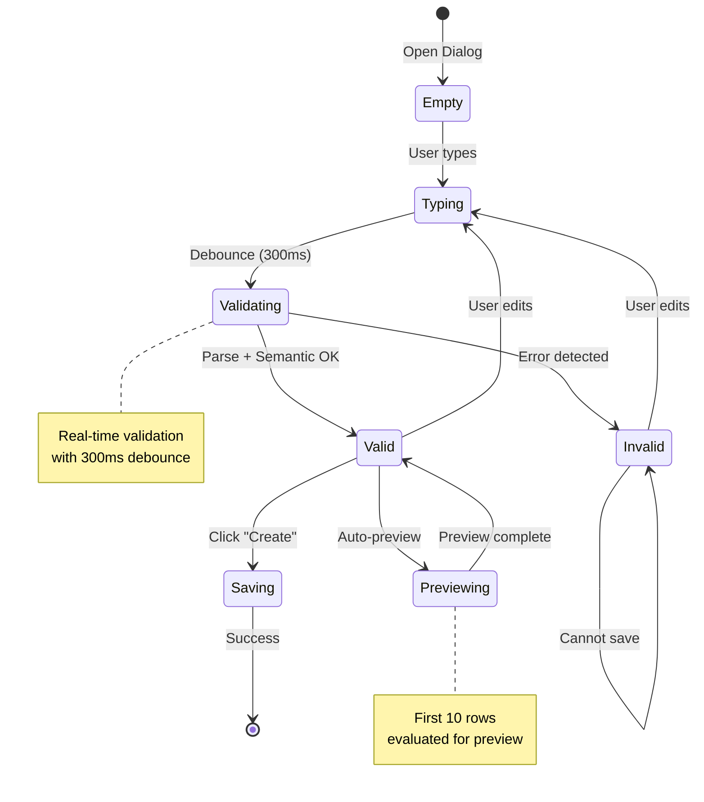

#### Syntax Highlighting

| Token Type | Color (suggested) |
|------------|-------------------|
| Variable reference (`@name`) | Blue |
| Function name | Purple |
| Number literal | Green |
| String literal | Orange |
| Operator | Gray |
| Parentheses | Dark gray |
| Error | Red underline |

#### Autocomplete

| Trigger | Shows |
|---------|-------|
| User types `@` | List of all column names |
| User types after `@` | Filtered column names matching prefix |
| User types letter (no `@`) | Function names matching prefix |
| User types `(` after function | Parameter signature hint |

**Autocomplete item format:**

```
┌─────────────────────────────────────────┐
│ @result_data.minimized_affinity         │
│ @mol_weight                             │
│ @smiles_column                          │
├─────────────────────────────────────────┤
│ AVG(column) → number                    │
│   Arithmetic mean of values             │
│ ABS(x) → number                         │
│   Absolute value                        │
└─────────────────────────────────────────┘
```

**Keyboard navigation:**
- `↑` / `↓`: Navigate suggestions
- `Tab` or `Enter`: Accept suggestion
- `Escape`: Dismiss autocomplete

#### Real-time Validation

- Debounce: 300ms after last keystroke
- Show validation status below editor:
  - ✓ "Formula is valid" (green)
  - ✗ "Error: Unknown variable '@foo'" (red)
  - ✗ "Error: Expected ')' at position 15" (red)

### 7.4 Preview Panel

- Shows **first 10 rows of the dataset** (not viewport-dependent)
- Columns displayed:
  - Referenced source columns
  - Intermediate aggregation values (if any)
  - Final result
- Updates in real-time as formula changes (debounced)
- Shows `#ERROR` for rows with runtime errors
- Shows `null` for null results

### 7.5 Edit Existing Formula

**Trigger:** Column header menu → "Edit Formula"

Opens same dialog, pre-populated with existing formula and column name.

Column name field is editable. Renaming auto-updates all dependent formulas.

### 7.6 Delete Formula Column

**Trigger:** Column header menu → "Delete Column"

**Behavior:**
1. Check for dependent formula columns
2. If dependencies exist:
   - Show dialog listing all dependent columns
   - Block deletion until dependencies are removed
3. If no dependencies:
   - Confirm deletion
   - Remove column

```
┌─────────────────────────────────────────────────────────────────┐
│  Cannot Delete Column                                      [X]  │
├─────────────────────────────────────────────────────────────────┤
│                                                                 │
│  The column "normalized_score" cannot be deleted because        │
│  the following formula columns depend on it:                    │
│                                                                 │
│    • weighted_score                                             │
│    • final_ranking                                              │
│                                                                 │
│  Please delete or modify these columns first.                   │
│                                                                 │
│                                                      [OK]       │
└─────────────────────────────────────────────────────────────────┘
```

### 7.7 Column Rename Flow

When renaming a column (source or formula):

1. Show list of formula columns that reference this column
2. Confirm rename
3. Auto-update all formulas to use new name
4. Revalidate all affected formulas (should all pass if just a rename)

---

## 8. Error Handling

### 8.1 Error Categories

#### Error Classification Flow

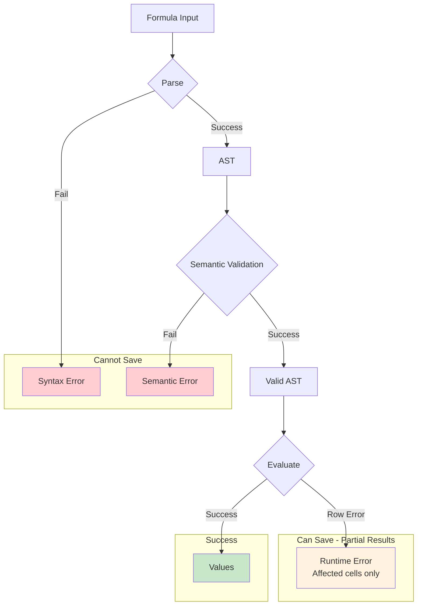

#### Syntax Errors

Detected at parse time. Formula cannot be saved.

| Error | Example | Message |
|-------|---------|---------|
| Unexpected token | `@a + + @b` | "Unexpected '+' at position 6" |
| Missing parenthesis | `IF(@a > 0, @a` | "Expected ')' at end of input" |
| Unknown function | `FOO(@a)` | "Unknown function 'FOO'" |
| Unknown variable | `@nonexistent` | "Unknown variable 'nonexistent'" |
| Invalid literal | `1.2.3` | "Invalid number literal at position 0" |

#### Semantic Errors

Detected at validation time. Formula cannot be saved.

| Error | Example | Message |
|-------|---------|---------|
| Type mismatch | `"hello" + 5` | "Cannot add string and number" |
| Wrong argument count | `IF(@a > 0, @a)` | "IF requires 3 arguments, got 2" |
| Wrong argument type | `AVG("hello")` | "AVG requires numeric variable, got string" |
| Circular reference | `@self + 1` (where self is this variable) | "Circular reference detected" |

#### Runtime Errors

Detected during evaluation. **Errors are collected, not thrown.** Evaluation continues for all rows, and errors are returned in `BatchResult.errors`.

| Error Code | Example | Cell Display | Collected As |
|------------|---------|--------------|--------------|
| `DIV_BY_ZERO` | `@a / @b` where `@b` is 0 | `#DIV/0!` | `{ code: 'DIV_BY_ZERO', rowIndex, variableName: 'b' }` |
| `DOMAIN_ERROR` | `LOG(-1)` | `null` | `{ code: 'DOMAIN_ERROR', rowIndex, details: { value: -1 } }` |
| `OVERFLOW` | `POWER(10, 1000)` | `#NUM!` | `{ code: 'OVERFLOW', rowIndex }` |

**Error collection example:**

```typescript
const result = await engine.evaluateBatch(ast, context);

console.log(result.successCount);  // 9998
console.log(result.errorCount);    // 2
console.log(result.hasErrors);     // true

for (const error of result.errors) {
  console.log(`Row ${error.rowIndex}: ${error.code} - ${error.message}`);
  // Row 42: DIV_BY_ZERO - Division by zero in @denominator
  // Row 1500: INVALID_SMILES - Invalid SMILES string in @molecule
}
```

### 8.2 Error Display

#### In Editor

- Syntax/semantic errors shown below editor with red styling
- Error position highlighted in formula text
- Cannot save formula until errors resolved

#### In Grid

| Location | Display |
|----------|---------|
| Column header | Warning icon (⚠) if any cells have errors |
| Cell | Error code (`#DIV/0!`, `#NUM!`) or `null` |
| Tooltip on cell | Full error message |

### 8.3 Error Codes

| Code | Meaning |
|------|---------|
| `#DIV/0!` | Division by zero |
| `#NUM!` | Numeric overflow or invalid math operation |
| `#REF!` | Reference to deleted variable (should not occur with safeguards) |
| `null` | Missing value or invalid input to function |

---

## 9. Performance & Scalability

### 9.1 Scale Requirements

| Dataset Size | Expected Behavior |
|--------------|-------------------|
| 20 - 1,000 rows | Instant (<100ms) |
| 1,000 - 100,000 rows | Fast (<1s) |
| 100,000 - 1,000,000 rows | Progress bar, <10s |
| 1,000,000 - 20,000,000 rows | Progress bar, chunked processing, cancellable |

### 9.2 Non-Blocking Evaluation

**Requirement:** UI must never freeze during computation.

**Implementation:**
- Use Web Workers for formula evaluation
- Chunk processing: evaluate N rows, yield to main thread, repeat
- Suggested chunk size: 10,000 rows (tune based on formula complexity)

#### Web Worker Evaluation Flow

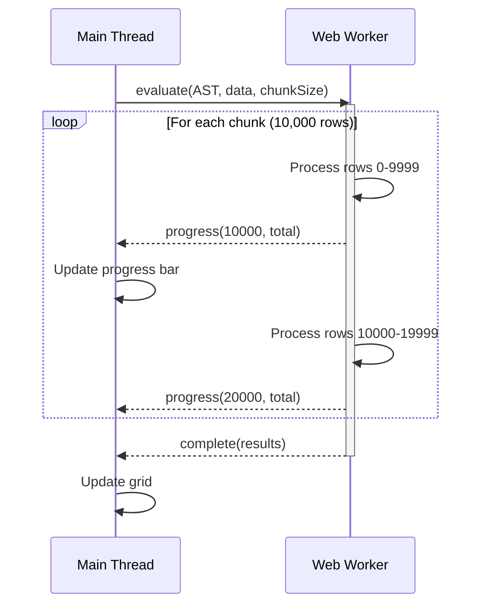

**Note:** The current MVP implementation uses chunked main-thread execution instead of Web Workers. This diagram illustrates the future Web Worker architecture for larger datasets.

#### Cancellation Flow

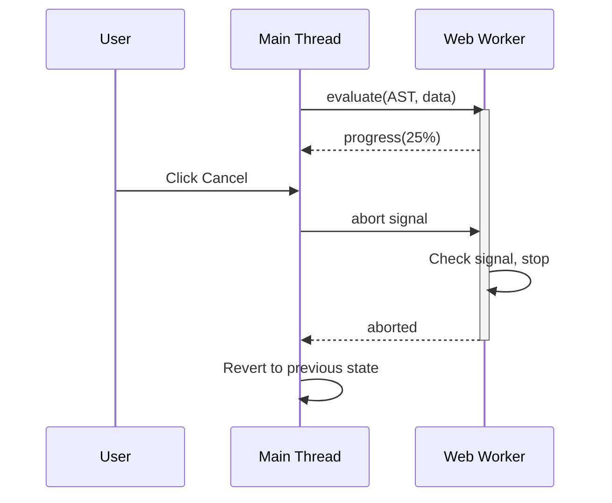

### 9.3 Progress UI

For operations exceeding 500ms:

```
┌─────────────────────────────────────────────────────────────────┐
│  Evaluating formula...                                          │
│                                                                 │
│  [████████████████████░░░░░░░░░░░░░░░░░░░░]  52%               │
│                                                                 │
│  10,400,000 / 20,000,000 rows  •  ~8 sec remaining             │
│                                                                 │
│                                                      [Cancel]   │
└─────────────────────────────────────────────────────────────────┘
```

**Features:**
- Percentage complete
- Rows processed / total
- Estimated time remaining
- Cancel button (aborts and reverts)

### 9.4 Streaming Results

During evaluation:
- Show partial results as they compute
- Grid displays computed rows, blank/loading for pending
- User can scroll to see computed sections

### 9.5 RDKit Performance

RDKit WASM operations are relatively expensive (~1-10ms per molecule).

**Optimizations:**
- Cache RDKit mol objects where possible
- Batch SMILES parsing
- Consider memoization for repeated SMILES values

**Future optimization:** Server-side RDKit for large datasets.

### 9.6 Dependency Graph Optimization (Future)

MVP uses column-level recomputation. Future optimizations:

1. **Row-level tracking:** Track dirty rows, propagate through graph
2. **Lazy evaluation:** Only compute visible rows initially
3. **Incremental aggregations:** Update aggregates incrementally when single values change

---

## 10. Technical Architecture

### 10.1 Layered Package Structure

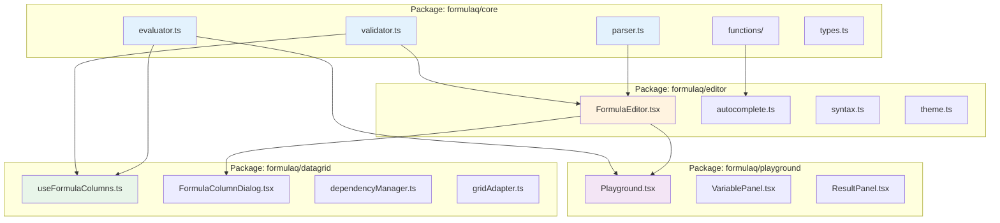

**Package dependencies:**
```
formulaq/core       → (none)
formulaq/editor     → formulaq/core, react, @codemirror/*
formulaq/datagrid   → formulaq/core, formulaq/editor, react, @mui/x-data-grid
formulaq/playground → formulaq/core, formulaq/editor, react
```

### 10.2 High-Level Components

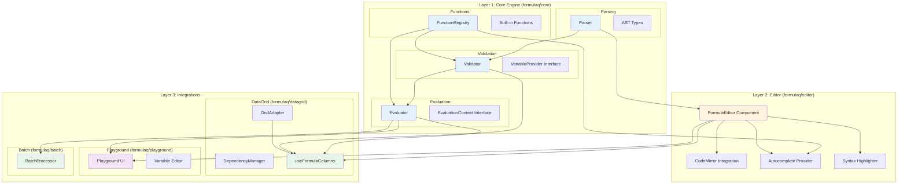

### 10.3 Component Responsibilities

| Layer | Component | Responsibility |
|-------|-----------|----------------|
| **Core** | **Parser** | Convert formula string to AST, syntax validation |
| **Core** | **Validator** | Type checking, unknown variable detection, semantic validation |
| **Core** | **Evaluator** | Execute AST against EvaluationContext, handle aggregations |
| **Core** | **FunctionRegistry** | Store function definitions, provide metadata for autocomplete |
| **Editor** | **FormulaEditor** | React component hosting CodeMirror |
| **Editor** | **Autocomplete** | Suggest variables and functions based on VariableProvider |
| **Editor** | **Syntax Highlighter** | Lezer grammar for formula syntax |
| **Integration** | **DataGrid Adapter** | Map DataGrid columns to VariableProvider, rows to EvaluationContext |
| **Integration** | **DependencyManager** | Track formula column dependencies, trigger recalculation |
| **Integration** | **BatchProcessor** | Transform data arrays using formulas |
| **Integration** | **Playground** | Interactive formula testing UI |
| **Worker** | **Web Worker Pool** | Off-main-thread evaluation for large datasets |
| **Worker** | **RDKit WASM** | Chemistry calculations, loaded in worker |

### 10.3 Data Flow

```mermaid
flowchart LR
    subgraph Input
        FS[Formula String]
    end
    
    subgraph Parsing
        FS -->|parse| AST[Abstract Syntax Tree]
        AST -->|validate| SC{Semantic Check}
    end
    
    subgraph Validation
        SC -->|pass| Valid[Valid AST]
        SC -->|fail| SE[Semantic Error]
    end
    
    subgraph Evaluation
        Valid -->|evaluate| WW[Web Worker]
        WW -->|compute| VA[Values Array]
    end
    
    subgraph Output
        VA -->|update| COL[Column Data]
        COL -->|render| GRID[DataGrid]
    end
    
    style FS fill:#e3f2fd
    style AST fill:#fff8e1
    style Valid fill:#e8f5e9
    style SE fill:#ffebee
    style VA fill:#f3e5f5
    style COL fill:#e0f2f1
```

#### Detailed Parse → Evaluate Flow

```mermaid
sequenceDiagram
    participant User
    participant Editor
    participant Parser
    participant Validator
    participant Evaluator
    participant Worker
    participant Grid

    User->>Editor: Enter formula
    Editor->>Parser: parse(formulaString)
    
    alt Parse Error
        Parser-->>Editor: SyntaxError
        Editor-->>User: Show error inline
    else Parse Success
        Parser->>Validator: validate(AST)
        
        alt Validation Error
            Validator-->>Editor: SemanticError
            Editor-->>User: Show error inline
        else Validation Success
            Validator->>Evaluator: evaluate(AST, data)
            Evaluator->>Worker: computeAsync(AST, chunks)
            
            loop For each chunk
                Worker->>Worker: Process rows
                Worker-->>Evaluator: Partial results
                Evaluator-->>Grid: Update visible rows
            end
            
            Worker-->>Evaluator: Complete
            Evaluator-->>Grid: Final update
            Grid-->>User: Display results
        end
    end
```

### 10.4 Integration Adapters

#### DataGrid Adapter

```mermaid
flowchart TD
    subgraph "DataGrid Integration"
        Hook[useFormulaColumns Hook]
        Dialog[FormulaColumnDialog]
        DM[DependencyManager]
        RA[RowAdapter]
    end
    
    subgraph "Core Engine"
        E[Evaluator]
        V[Validator]
    end
    
    subgraph "MUI DataGrid"
        Grid[DataGrid]
        Cols[Column Definitions]
        Rows[Row Data]
    end
    
    Dialog -->|formula string| V
    V -->|validated AST| Hook
    Hook --> DM
    DM -->|evaluation order| E
    
    Rows -->|EvaluationContext| RA
    RA --> E
    E -->|results| Hook
    Hook -->|formula columns| Cols
    Cols --> Grid
    
    style Hook fill:#e8f5e9
    style E fill:#e3f2fd
```

```typescript
// DataGrid integration hook
function useFormulaColumns(
  baseColumns: GridColDef[],
  rows: Record<string, unknown>[]
): {
  columns: GridColDef[];           // Base + formula columns
  formulaColumns: FormulaColumn[]; // Formula column definitions
  addFormula: (name: string, formula: string) => Promise<void>;
  editFormula: (id: string, formula: string) => Promise<void>;
  removeFormula: (id: string) => void;
  isEvaluating: boolean;
  progress: number;                // 0-1
}
```

#### Batch Processor Adapter

```typescript
// Standalone batch processing
const processor = createBatchProcessor(engine);

const results = await processor.transform(
  data,           // Array of records
  formulas: {     // Named formulas to compute
    normalized: '@score / AVG(@score)',
    isActive: '@status == "active"',
    molWeight: 'MW(@smiles)'
  },
  { 
    chunkSize: 10000,
    onProgress: (pct) => console.log(`${pct}% complete`)
  }
);

// results = original data + new computed fields
```

### 10.5 Formula Storage

Formulas stored as raw strings in application state:

```typescript
interface FormulaColumn {
  id: string;
  name: string;
  formula: string;
  // Cached parsed AST (not persisted)
  ast?: ASTNode;
  // Cached dependency list
  dependencies?: string[];
  // Materialized values (derived, not persisted)
  values?: (number | null)[];
}
```

### 10.6 Recommended Libraries

| Component | Library | License | Rationale |
|-----------|---------|---------|-----------|
| Parser | **Chevrotain** | Apache 2.0 | Excellent error recovery, fast, well-maintained |
| Editor | **CodeMirror 6** | MIT | Modern, lightweight, extensible |
| Syntax highlighting | **Lezer** (CodeMirror) | MIT | Incremental parsing, custom grammars |
| Math evaluation | Custom (part of engine) | — | Full control over semantics |
| Chemistry | **RDKit.js** | BSD | Industry standard, WASM build available |

### 10.7 Bundle Considerations

| Library | Approx Size | Notes |
|---------|-------------|-------|
| CodeMirror 6 (core + lang) | ~150KB | Tree-shakeable |
| Chevrotain | ~50KB | Minimal |
| RDKit.js (WASM) | ~8MB | Load in worker, lazy-load if possible |

**Recommendation:** Lazy-load RDKit WASM only when chemistry functions are used.

### 10.8 FormulaQ Playground

The FormulaQ Playground provides an early prototype for testing formulas without DataGrid integration.

#### Playground Architecture

```mermaid
flowchart TD
    subgraph "Playground Component"
        subgraph "Left Panel"
            VE[Variable Editor<br/>Define test variables]
            VL[Variable List<br/>Name, Type, Values]
        end
        
        subgraph "Center Panel"
            FE[Formula Editor<br/>CodeMirror]
            ST[Status Bar<br/>Valid / Error]
        end
        
        subgraph "Right Panel"
            RP[Results Panel<br/>Evaluated output]
            EP[Error Panel<br/>Runtime errors]
        end
    end
    
    VE --> VL
    VL -->|VariableProvider| FE
    FE -->|AST| RP
    VL -->|EvaluationContext| RP
    
    style FE fill:#e3f2fd
    style RP fill:#e8f5e9
```

#### Playground Wireframe

```
┌────────────────────────────────────────────────────────────────────────────┐
│  FormulaQ Playground                                            [⚙] [?]  │
├──────────────────────┬─────────────────────────┬───────────────────────────┤
│  Variables           │  Formula                │  Results                  │
├──────────────────────┼─────────────────────────┼───────────────────────────┤
│  + Add Variable      │  ┌─────────────────────┐│  ┌───────────────────────┐│
│                      │  │ @score / AVG(@score)││  │ Index │ Result       ││
│  ┌────────────────┐  │  │                     ││  ├───────┼──────────────┤│
│  │ score: number  │  │  │                     ││  │ 0     │ 0.85         ││
│  │ [85, 92, 78,   │  │  └─────────────────────┘│  │ 1     │ 1.08         ││
│  │  90, 88]       │  │                         │  │ 2     │ 0.92         ││
│  │ [Edit] [×]     │  │  ✓ Formula is valid     │  │ 3     │ 1.06         ││
│  └────────────────┘  │                         │  │ 4     │ 1.04         ││
│                      │  Aggregations:          │  └───────────────────────┘│
│  ┌────────────────┐  │  • AVG(@score) = 86.6   │                           │
│  │ name: string   │  │                         │  Statistics:              │
│  │ ["Alice",      │  │                         │  • Min: 0.85              │
│  │  "Bob", ...]   │  │                         │  • Max: 1.08              │
│  │ [Edit] [×]     │  │                         │  • Nulls: 0               │
│  └────────────────┘  │                         │  • Errors: 0              │
│                      │                         │                           │
└──────────────────────┴─────────────────────────┴───────────────────────────┘
```

#### Playground Features

| Feature | Description |
|---------|-------------|
| **Variable Editor** | Add/edit/remove test variables with types and sample values |
| **Multi-row data** | Each variable can have multiple values (array) for batch testing |
| **Live evaluation** | Results update in real-time as formula or data changes |
| **Aggregation display** | Shows computed aggregation values separately |
| **Error highlighting** | Shows which rows have runtime errors |
| **Import/Export** | Load/save variable sets and formulas as JSON |

#### Playground State

```typescript
interface PlaygroundState {
  /** User-defined test variables */
  variables: PlaygroundVariable[];
  
  /** Current formula string */
  formula: string;
  
  /** Parsed and validated AST (if valid) */
  ast: ValidatedAST | null;
  
  /** Validation error (if any) */
  validationError: FormulaError | null;
  
  /** Evaluation results */
  results: Value[] | null;
  
  /** Runtime errors by row index */
  runtimeErrors: Map<number, RuntimeError>;
}

interface PlaygroundVariable {
  id: string;
  name: string;
  type: ValueType;
  values: (number | string | boolean | null)[];
}
```

#### Playground as Development Tool

The Playground serves multiple purposes:

1. **Early prototype** — Validate engine behavior before DataGrid integration
2. **Testing tool** — QA can test edge cases without full app setup
3. **Documentation** — Interactive examples for end users
4. **Debugging** — Developers can isolate formula issues

```mermaid
flowchart LR
    subgraph "Development Phases"
        P1[Phase 1<br/>Core Engine]
        P2[Phase 2<br/>Playground]
        P3[Phase 3<br/>Editor Component]
        P4[Phase 4<br/>DataGrid Integration]
    end
    
    P1 -->|"Test via unit tests"| P2
    P2 -->|"Test interactively"| P3
    P3 -->|"Integrate"| P4
    
    style P1 fill:#e3f2fd
    style P2 fill:#fff3e0
    style P3 fill:#e8f5e9
    style P4 fill:#f3e5f5
```

---

## 11. Future Roadmap

**Note:** The MVP implementation is complete. The milestones below represent completed work and future phases.

### FormulaQ MVP Milestones (Completed)

```mermaid
flowchart LR
    subgraph "Milestone 1: FormulaQ Core"
        M1A[Parser]
        M1B[Validator]
        M1C[Evaluator]
        M1D[Basic Functions]
    end

    subgraph "Milestone 2: FormulaQ Playground"
        M2A[Variable Editor]
        M2B[Results Panel]
        M2C[Interactive Testing]
    end

    subgraph "Milestone 3: FormulaQ Editor"
        M3A[CodeMirror Integration]
        M3B[Autocomplete]
        M3C[Syntax Highlighting]
    end

    subgraph "Milestone 4: FormulaQ DataGrid"
        M4A[Column Adapter]
        M4B[Dependency Manager]
        M4C[Dialog Integration]
    end

    M1A --> M1B --> M1C --> M1D
    M1D --> M2A
    M2A --> M2B --> M2C
    M2C --> M3A
    M3A --> M3B --> M3C
    M3C --> M4A
    M4A --> M4B --> M4C
    
    style M1A fill:#e3f2fd
    style M2A fill:#fff3e0
    style M3A fill:#e8f5e9
    style M4A fill:#f3e5f5
```

| Milestone | Deliverable | Success Criteria |
|-----------|-------------|------------------|
| **M1: FormulaQ Core** | `formulaq/core` package | Parse, validate, evaluate formulas; unit tests pass |
| **M2: FormulaQ Playground** | Interactive web app | Can define variables, enter formulas, see results |
| **M3: FormulaQ Editor** | `FormulaEditor` component | Autocomplete, syntax highlighting, error display |
| **M4: FormulaQ DataGrid** | `useFormulaColumns` hook | Add/edit/delete formula columns in MUI DataGrid |

### 11.1 Phase 2: Enhanced Functions

| Feature | Description |
|---------|-------------|
| Additional aggregations | `MEDIAN`, `STDEV`, `STDEVP`, `VAR`, `VARP` |
| Additional math | `ABS`, `SQRT`, `ROUND`, `FLOOR`, `CEIL`, `EXP`, `MOD`, `SIGN`, `SIN`, `COS`, `TAN` |
| Conditional aggregations | `SUMIF`, `COUNTIF`, `AVERAGEIF`, `MINIF`, `MAXIF` |
| String functions | `UPPER`, `LOWER`, `TRIM`, `SUBSTRING`, `LEN`, `LEFT`, `RIGHT`, `FIND` |

### 11.2 Phase 3: RDKit Chemistry Functions

RDKit-based chemistry functions for molecular property calculations. These require the RDKit.js WASM library and a `string.smiles` semantic type for SMILES strings.

| Function | Signature | Description |
|----------|-----------|-------------|
| `TPSA` | `TPSA(@smiles) → number` | Topological polar surface area (Ų) |
| `LOGP` | `LOGP(@smiles) → number` | Wildman-Crippen LogP |
| `HBD` | `HBD(@smiles) → number` | Hydrogen bond donor count |
| `HBA` | `HBA(@smiles) → number` | Hydrogen bond acceptor count |
| `NUM_RINGS` | `NUM_RINGS(@smiles) → number` | Number of rings |
| `MW` | `MW(@smiles) → number` | Molecular weight |
| `FINGERPRINT` | `FINGERPRINT(@smiles, type) → string` | Generate molecular fingerprint |
| `TANIMOTO` | `TANIMOTO(@smiles1, @smiles2) → number` | Tanimoto similarity |
| `SUBSTRUCTURE_MATCH` | `SUBSTRUCTURE_MATCH(@smiles, @pattern) → boolean` | SMARTS pattern matching |

**Implementation Notes:**
- RDKit.js WASM (~8MB) should be lazy-loaded only when chemistry functions are used
- Invalid SMILES returns `null`, not an error
- Consider loading RDKit in a Web Worker for large datasets

### 11.4 Phase 5: Date/Time Support

| Feature | Description |
|---------|-------------|
| `datetime` type | Native date/time values |
| `YEAR`, `MONTH`, `DAY`, `HOUR`, `MINUTE` | Extract components |
| `DATEDIFF` | Difference between dates |
| `NOW`, `TODAY` | Current date/time |

### 11.5 Phase 6: Performance Optimizations

| Feature | Description |
|---------|-------------|
| Row-level incremental updates | Only recompute changed rows |
| Virtual evaluation | Compute on-demand for visible rows |
| Parallel evaluation | Multiple workers for large datasets |
| Server-side evaluation | Offload to backend for 10M+ rows |

### 11.6 Phase 7: Advanced Features

| Feature | Description |
|---------|-------------|
| Cross-column aggregations | `VLOOKUP`, `INDEX/MATCH` equivalents |
| Window functions | `RANK`, `ROW_NUMBER`, `LAG`, `LEAD` |
| User-defined functions | Runtime plugin system (if needed) |
| Formula debugging | Step-through evaluation, intermediate values |

---

## 12. Appendix: OSS Library Candidates

### 12.1 Parser Libraries

| Library | License | Pros | Cons | Recommendation |
|---------|---------|------|------|----------------|
| **Chevrotain** | Apache 2.0 | Excellent error messages, fast, great docs, TypeScript | Learning curve | **Recommended** |
| **Peggy** (PEG.js successor) | MIT | Clean grammar syntax, easy to learn | Slower, less flexible error recovery | Good alternative |
| **math.js** | Apache 2.0 | Full-featured, extensible, built-in functions | Large bundle, opinionated syntax | Use for inspiration, not directly |
| **hot-formula-parser** | MIT | Excel-compatible | Less extensible, tied to Handsontable | Not recommended |
| **expr-eval** | MIT | Lightweight | Limited features, poor extensibility | Not recommended |

### 12.2 Editor Libraries

| Library | License | Pros | Cons | Recommendation |
|---------|---------|------|------|----------------|
| **CodeMirror 6** | MIT | Modern, fast, extensible, lightweight | Newer, less community content | **Recommended** |
| **Monaco Editor** | MIT | Full VS Code features, excellent autocomplete | Large bundle (~2MB), overkill | Not recommended for this use case |
| **Ace Editor** | BSD | Mature, well-documented | Older architecture | Not recommended |

### 12.3 Chemistry Libraries

| Library | License | Pros | Cons | Recommendation |
|---------|---------|------|------|----------------|
| **RDKit.js** | BSD | Industry standard, comprehensive | Large WASM (~8MB), limited JS API | **Recommended** |
| **OpenChemLib JS** | BSD | Smaller, fast | Fewer descriptors than RDKit | Alternative for basic needs |
| **Kekule.js** | MIT | Pure JS, no WASM | Limited cheminformatics | Not recommended for descriptors |

### 12.4 Utility Libraries

| Library | License | Use Case | Notes |
|---------|---------|----------|-------|
| **Comlink** | Apache 2.0 | Web Worker communication | Simplifies worker API |
| **lodash** | MIT | Utility functions | Use for topological sort, etc. |
| **immer** | MIT | Immutable state updates | For column state management |

---

## 13. Glossary

| Term | Definition |
|------|------------|
| **AST** | Abstract Syntax Tree — parsed representation of a formula |
| **Aggregation** | Function that operates on entire variable array (e.g., `AVG`, `SUM`, `MAX`) |
| **BatchResult** | Return type of `evaluateBatch()` containing values and collected errors |
| **Broadcast** | Scalar value from aggregation applied to all rows |
| **EvaluationContext** | Interface providing variable values at evaluation time |
| **FormulaQ** | The name of this formula engine project |
| **Materialization** | Computing and storing formula results |
| **Nullable** | Property indicating whether a variable can contain null values |
| **RuntimeError** | Error occurring during evaluation (collected, not thrown) |
| **Scalar Mode** | Evaluating a formula with single-element variable arrays |
| **Batch Mode** | Evaluating a formula across multiple rows of data |
| **SMILES** | Simplified Molecular Input Line Entry System — string notation for molecules |
| **Topological Sort** | Ordering of dependency graph for sequential evaluation |
| **ValueType** | Hierarchical type system: `number.integer`, `number.float`, `string.text`, `boolean.boolean` |
| **VariableProvider** | Interface providing variable metadata for validation and autocomplete |
| **VariableRef** | AST node type representing a reference to a variable (`@name`) |
| **WASM** | WebAssembly — binary format for running compiled code in browser |

---

## 14. Document History

| Version | Date | Author | Changes |
|---------|------|--------|---------|
| 1.0 | — | — | Initial MVP specification |

---
